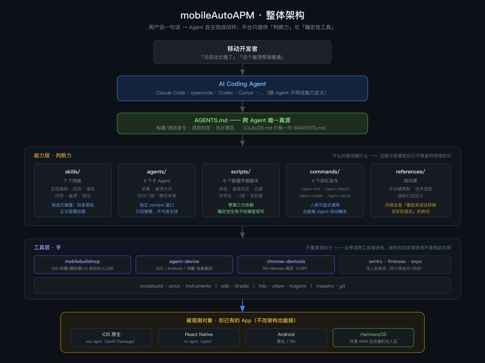

# 架构

> 面向「要改这个项目的人或 AI agent」。约定与命令见 [`AGENTS.md`](AGENTS.md)。



*（[SVG 版](docs/diagrams/architecture.svg) · 由 `tools/build-diagrams.sh` 从同目录 SVG 生成）*

---

## 一、整体形状

```
                    用户（移动开发者）
                          │
                    说一句需求
                          │
        ┌─────────────────┴─────────────────┐
        │        AI Coding Agent            │
        │  （Claude Code / opencode / …）    │
        └─────────────────┬─────────────────┘
                          │ 读
        ┌─────────────────┴─────────────────┐
        │      AGENTS.md（唯一真源）          │
        └─────────────────┬─────────────────┘
                          │ 加载
   ┌──────────────────────┴──────────────────────┐
   │              能力层（core）                  │
   │                                             │
   │  skills/     判断力：什么时候该做什么          │
   │  agents/     分工：采集 / 分诊 / 门禁 / 审查   │
   │  commands/   入口：用户可直接调用             │
   │  scripts/    数据平面：确定性任务交给脚本      │
   │  references/ 知识库：平台硬限制与指标口径      │
   └──────────────────────┬──────────────────────┘
                          │ 调用
   ┌──────────────────────┴──────────────────────┐
   │              工具层（hands）                 │
   │                                             │
   │  MCP：mobilebuildmcp / agent-device /        │
   │       chrome-devtools / firebase / sentry   │
   │  CLI：xcodebuild / adb / hdc / maestro      │
   └──────────────────────┬──────────────────────┘
                          │ 作用
   ┌──────────────────────┴──────────────────────┐
   │           被观测对象（用户的 App）             │
   │                                             │
   │  ios-apm    应用侧埋点（iOS 原生）    │
   │  rn-apm     应用侧埋点（React Native）│
   └─────────────────────────────────────────────┘
```

---

## 二、两根支柱

```
        ┌──────────────────────────────────────┐
        │            mobileAutoAPM             │
        ├──────────────────┬───────────────────┤
        │   支柱 A          │     支柱 B         │
        │   项目 AI 化改造   │    APM 自主闭环     │
        ├──────────────────┼───────────────────┤
        │ 扫描 → 评分       │ 发现 → 定位        │
        │ 生成改造项        │ 修复 → 验证        │
        │ 执行 → 复扫       │ 防劣化             │
        └──────────────────┴───────────────────┘
                    ↑                    ↑
                    └────────┬───────────┘
                      共享工具层与知识层
```

### 为什么 A 在 B 前面

> **支柱 A 的产物，正是支柱 B 能自主工作的前提。**

一个没有测试、构建命令不明、缺 context 文件的项目，agent 既无法理解它，
也**无法验证自己的任何改动** —— 此时"自主优化性能"是空话。

反过来也成立：支柱 B 跑起来后会产生大量实测数据，
这些数据又反过来告诉支柱 A 该补哪些验证手段（例如"没有性能基线"就是 A 的缺口）。

**两者是正反馈关系，不是并列关系。**

---

## 三、闭环的数据流


*（[SVG 版](docs/diagrams/loop.svg)）*

这是整个平台的核心机制。**每一环都必须可验证，否则闭环断裂。**

```
    ┌─────────┐
    │  发现    │  采集数据 → 与基线对比 → 判定劣化
    └────┬────┘  apm-profiler 子 Agent + apm_baseline.py
         │       退出码 2 = 有劣化
         ▼
    ┌─────────┐
    │  定位    │  根因必须在代码里指到具体位置，且**有 profile 数据支撑**
    └────┬────┘  猜出来的根因不算根因
         │
         ▼
    ┌─────────┐
    │  修复    │  单变量 —— 一次只改一处
    └────┬────┘  优先结构性修复（删/延迟/并发），而非微优化
         │
         ▼
    ┌─────────┐
    │  验证    │  ★ 最容易糊弄的一步
    └────┬────┘  同口径复测 + 置换检验 + 功能回归
         │       幅度在噪声内 → 如实说"无显著改善"
         │
         ▼
    ┌─────────┐
    │  防劣化  │  写入基线 → CI 门禁 → 不做就会随时间被侵蚀
    └─────────┘
```

### 数据平面（`scripts/`）

**为什么这部分必须是脚本而不是让模型每次生成**：
确定性任务交给脚本，结果才可复现。让模型每次现写一遍解析逻辑，
既浪费 token，又引入不确定性。

| 脚本 | 职责 | 关键设计 |
|---|---|---|
| `apm_doctor.py` | 能力体检 | 明确"本机现在真的能做什么"，不假设工具存在 |
| `apm_baseline.py` | 显著性判定 + 质量闸门 | **置换检验**；高方差/多模态/口径问题不再包装成改善或劣化 |
| `apm_measure.py` | 标准测量 profile | iOS 原生真机硬校验；保留逐次 observations、原始日志与 context |
| `apm_feasibility.py` | 可行性/对照组闸门 | 目标低于 control 地板时停止局部优化，升级架构决策 |
| `apm_diagnose.py` | 方差诊断与判据建议 | CV、疑似多簇、分段 CV、可疑变量相关性；相关不等于因果 |
| `apm_white_screen.py` | 白屏检测 | 纯标准库解 PNG；三重证据避免纯色页面误判 |
| `apm_screenshot.py` | iOS 真机截图 | DVT/pymobiledevice3 优先，idevicescreenshot 回退；物理真机硬校验 |
| `rn_symbolicate.py` | 堆栈符号化 | 纯标准库实现 VLQ；**Hermes 两步合成** |
| `rn_build_symbols.py` | 符号门禁 | 退出码 2 可直接作 CI 门禁 |
| `ai_readiness.py` | AI 友好度扫描 | 5 维度 20+ 检查项，每条给依据/后果/修法 |
| `ai_remediate.py` | 支柱 A 改造闭环 | `plan`/`generate`/`loop`/`apply`；生成物一律留 TODO 占位，`loop` 在临时副本上实测 before/after |

---

## 四、适配层：为什么是生成而不是手写

```
        plugins/mobile-apm/（唯一真源）
                  │
        tools/build-portable.py
                  │
     ┌────────────┴────────────┐
     ▼                         ▼
 .claude/                  .opencode/
 （Claude Code 原生）        （opencode 原生）
 + plugin 分发包
```

**手写两份必然漂移。** 改了 Claude 侧忘了改 opencode 侧，是这类项目最常见的腐化方式。

生成器处理了三个**会致命的兼容点**：

1. opencode 要求 `name` 与 `description` **同时存在**，缺一个该 skill **完全不加载**
2. `${CLAUDE_PLUGIN_ROOT}` 在 opencode 里是**字面量** → 重写为工程根相对路径
3. hook 机制差异最大（opencode 无 settings hooks）→ 生成桥接插件，
   把 `.claude/hooks/*.sh` 当子进程调，**一份逻辑服务两个 harness**

---

## 五、知识层

`plugins/mobile-apm/references/` 存的是**判断依据**，不是教程。

| 文件 | 内容 | 为什么重要 |
|---|---|---|
| `stack-selection.md` | 技术选型 + **各平台硬限制** | 例：鸿蒙是第一约束（Sentry/Firebase/Detox 全不可用）；iOS FOOM 是官方能力缺口 |
| `metrics-definitions.md` | 指标口径 | 例：用 PSS 不是 RSS；卡顿看 p95；RN 必须分离 JS/UI FPS |
| `rn-apm-sdk.md` | 埋点 SDK 用法与限制 | |

**这些文件的价值在于「看起来该这样做、但实际是坑」的内容。**
纯 API 文档模型自己就能查到，不需要我们写。

---

## 六、设计原则（贯穿全部代码）

| 原则 | 体现 |
|---|---|
| **绝不抛错、绝不阻塞** | 埋点不能影响业务；工具失败要降级不能崩 |
| **必须有界** | 所有缓冲定容 —— 测内存泄漏的工具自己不能泄漏 |
| **如实报告缺口** | 能力不可用时明说，不静默降级、不给假数据 |
| **口径先于数据** | 没有口径一致性的数字不参与任何对比 |
| **零依赖优先** | Python 工具只用标准库；SDK 无第三方运行时依赖 |

---

## 七、质量保障

```
提交前必须：
  ① 跑相关测试（116 Python + 74 RN + 11 iOS）
  ② ai_readiness.py 分数不退化
  ③ plugins/ 有改动 → 重新生成 dist/ 并确认无残留变量
  ④ 性能结论 → 必须附「命令 + 设备 + 样本量 + 显著性」
```

CI 见 `.github/workflows/ci.yml`。

**没有验证的改动不提交。宁可如实说"没验证"，也不要假装验证过了。**
