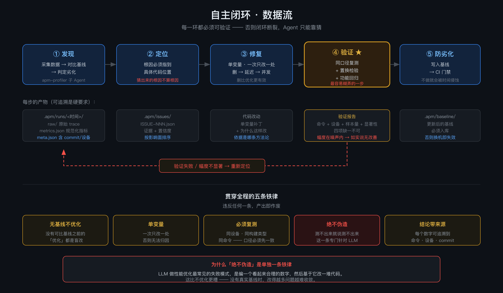
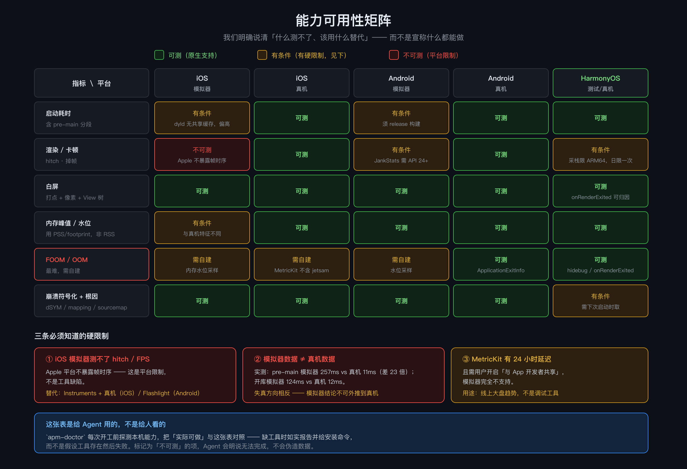

# mobileAutoAPM

**让 AI Agent 自己把 App 的性能问题修好。**

面向 iOS / React Native / HarmonyOS 的移动端 APM Agent 能力集 ——
**发现 → 定位根因 → 修复 → 验证 → 防劣化**，全程可复现。

```bash
claude plugin marketplace add davidtan2008/mobileAutoAPM
claude plugin install mobile-apm@mobile-apm-marketplace
```

然后在你自己的工程里说一句：

```
冷启动太慢了，帮我看看
```

Agent 会自己：测量 → 与基线对比 → 分段定位 → 改代码 → **同口径复测** → 给出显著性结论。



<sub>[SVG 版](docs/diagrams/loop.svg) · [完整架构](docs/diagrams/architecture.png)</sub>

---

## 为什么不是又一个 "AI + APM"

> 「LLM 做性能优化最常见的失败模式，是**编一个看起来合理的数字，
> 然后基于它改一堆代码**。」

这句话是整个项目的设计起点。所以我们把五条铁律写进了每一个技能里：

| 铁律 | 含义 |
|---|---|
| **无基线不优化** | 没有可比基线之前的"优化"都是盲改 |
| **单变量** | 一次只改一处，否则无法归因 |
| **必须复测** | 用**与基线完全相同的口径**（同设备、同构建类型、同命令） |
| **绝不伪造** | 测不出来就说测不出来 |
| **结论带来源** | 每个数字可追溯到：哪条命令、哪台设备、哪个 commit |

**这不只是口号** —— 判定由 `apm_baseline.py` 的**置换检验**执行，
它会主动识别「统计显著但幅度无意义」（实测中 −4.5% 的小改善会被判为"不具实际意义"，
而不是被包装成优化成果）。

---

## 和 Sentry / Firebase Crashlytics 有什么不同

| | Sentry / Crashlytics | **mobileAutoAPM** |
|---|---|---|
| 告诉你"慢了" | ✅ | ✅ |
| 告诉你"**哪里**慢" | 部分（要人去看） | ✅ Agent 自动分段定位 |
| **能复测验证** | ❌ | ✅ 同口径 + 置换检验 |
| **谁做归因** | 人 | Agent |
| 数字可否追溯 | 部分 | ✅ 每个数字带命令/设备/commit |
| **鸿蒙** | ❌ 不可用 | ✅ |
| 装上就能用 | 需接 SDK、发版、等数据 | ✅ 本地即可跑通 |

> 我们不是替代它们 —— 它们解决「线上看见了什么」，
> 我们解决「**看见了之后，谁去修、怎么证明修好了**」。

---

## 它能做什么

| 你说 | Agent 会做 |
|---|---|
| "冷启动太慢" | 测基线 → 分段定位（含 **pre-main**）→ 改 → 同口径复测 → 显著性判定 |
| "首页会白屏" | 多帧截图 + 像素分析 → 定位 → 修复 → 验证 |
| "内存一直涨" | 水位曲线 + 堆快照对比 → 查泄漏源 |
| "这个崩溃帮我看看" | 符号化（含 Hermes 两步合成）→ 聚类 → 根因 → 修复 → 验证 |
| "这次改动有性能风险吗" | **单变量回归门禁**，退出码直接可作 CI 门禁 |
| "把项目改造成 AI 友好的" | 扫描 → 评分 → 生成改造项 → 执行 → 复扫 |

### 两根支柱

```
        ┌──────────────────────────────────────┐
        │            mobileAutoAPM             │
        ├──────────────────┬───────────────────┤
        │   A 项目 AI 化改造 │   B APM 自主闭环   │
        │   遗留项目 →       │   发现 → 定位      │
        │   可读可改可验证    │   修复 → 验证      │
        └──────────────────┴───────────────────┘
                    共享工具层与知识层
```

**A 之所以在 B 前面**：一个没有测试、构建命令不明、缺 context 文件的项目，
Agent 既无法理解它，也**无法验证自己的任何改动** —— 此时谈"自主优化"是空话。

---

## 覆盖范围

| | iOS 原生 | React Native | Android | **HarmonyOS** |
|---|---|---|---|---|
| 启动耗时 | ✅ | ✅ | ✅ | ✅ |
| 渲染 / 卡顿 | ✅ | ✅ | ✅ | ✅ |
| 白屏 | ✅ | ✅ | ✅ | ✅ |
| 内存 / FOOM | ✅ | ✅ | ✅ | ✅ |
| 崩溃根因 | ✅ | ✅ | ✅ | ✅ |
| 回归门禁 | ✅ | ✅ | ✅ | ✅ |

> **鸿蒙在开源 APM 生态里几乎是无人区** —— Sentry / Firebase Crashlytics /
> Detox / OpenTelemetry 在鸿蒙上**全部不可用**。我们是少数覆盖它的。

### ⚠️ 但有些事**做不到** —— 这张表说清了哪些



我们这个市场充满了「AI 什么都能做」的宣称。所以这里明确说清**什么测不了、该用什么替代**：

| 测不了的 | 原因 | 替代方案 |
|---|---|---|
| **iOS 模拟器上的卡顿 / FPS** | Apple 平台不暴露帧时序，不是工具缺陷 | Instruments + **真机** |
| **模拟器数据代表真机** | 实测 pre-main 模拟器 257ms vs 真机 **11ms**（差 23 倍），失真方向还相反 | 必须真机 |
| **即时拿到线上启动数据** | MetricKit 有 **24 小时延迟**，模拟器完全不支持 | 线上看趋势，调试用本地 |

Agent 会**如实报告「无法完成」**，而不是伪造一个数字。

---

## 组成

| 模块 | 说明 |
|---|---|
| **7 个技能** | `apm-loop`（主控编排）· `apm-doctor` · `apm-startup` · `apm-render` · `apm-memory` · `apm-crash` · `apm-autotest` |
| **4 个子 Agent** | 采集 · 崩溃分诊 · 回归门禁 · 静态审查 |
| **2 个埋点 SDK** | [`ios-apm`](ios-apm/)（Swift Package）· [`rn-apm`](rn-apm/)（npm） |
| **6 个数据平面脚本** | 零第三方依赖，见下 |
| **跨 Agent 生成器** | `tools/build-portable.py`：一份源 → Claude Code / opencode 双目标 |

### 数据平面（确定性任务交给脚本，不交给模型每次现写）

```bash
S=plugins/mobile-apm/scripts

python3 $S/apm_doctor.py                 # 能力体检 —— 本机现在真的能做什么
python3 $S/apm_baseline.py compare \
  --baseline .apm/baseline/startup.json --run run.json   # 显著性判定（退出码 2 = 劣化）
python3 $S/apm_white_screen.py shot.png  # 白屏检测（纯标准库解 PNG）
python3 $S/rn_symbolicate.py compose \
  --outer bundle.hbc.map --inner bundle.map --out composed.map   # Hermes 两步合成
python3 $S/rn_build_symbols.py verify --platform ios --build-dir ios/build --strict
python3 $S/ai_readiness.py --path .      # AI 友好度扫描
```

---

## 快速开始

### 1. 确认本机能跑什么

```bash
python3 plugins/mobile-apm/scripts/apm_doctor.py
```

**它会如实告诉你哪些能力可用、哪些缺工具** —— 我们不假设任何工具存在。

### 2. 在你的工程里初始化

```
/apm-init
```

### 3. 然后直接说需求

见上方「它能做什么」。

### 用 opencode 或其它 Agent

```bash
python3 tools/build-portable.py
cp -R dist/. /path/to/your-app/     # ⚠️ 用 dist/. 不能用 dist/*
```

产出 `AGENTS.md` + `.claude/skills/` + `.opencode/`，
**一套源、多个 Agent 可用**，不是手写两份。

---

## 质量

```
Python 工具    61 个测试
rn-apm SDK     74 个测试
ios-apm SDK    11 个测试
```

```bash
python3 plugins/mobile-apm/tests/test_ai_readiness.py
python3 plugins/mobile-apm/tests/test_rn_symbolicate.py
cd rn-apm && npm test
cd ios-apm && swift test
```

---

## 文档

| | |
|---|---|
| [架构与数据流](ARCHITECTURE.md) | 整体形状、闭环机制、设计原则 |
| [**核心功能实现细节**](docs/IMPLEMENTATION.md) | 每个脚本/模块怎么实现的、为什么这样设计 |
| [项目约定](AGENTS.md) | **给 AI Agent 看的**（构建/测试/约定/禁区） |
| [落地蓝图](docs/APM-BLUEPRINT.md) | 还缺什么、怎么做 |
| [进度与完成度](docs/PROGRESS.md) | **含已知限制与未验证项** |
| [工具链与 MCP](docs/mcp-setup.md) | 环境配置（含本机实测） |
| [重构方案](docs/RESTRUCTURE-PLAN.md) | 定位与路线图 |
| [图表源文件](docs/diagrams/) | 架构图 / 闭环图 / 闸门图 / 能力矩阵 / 进化机制 |

> 我们有一份**如实标注未验证项**的进度文档。
> 在一个充满「AI 什么都能做」宣称的市场里，说清「这个还没做」是刻意的选择。

---

## 贡献

见 [`AGENTS.md`](AGENTS.md) —— 它同时是贡献指南与 Agent 上下文。
改动前请先跑测试；有性能结论的改动**必须附「命令 + 设备 + 样本量 + 显著性」**。

## License

[MIT](LICENSE)
